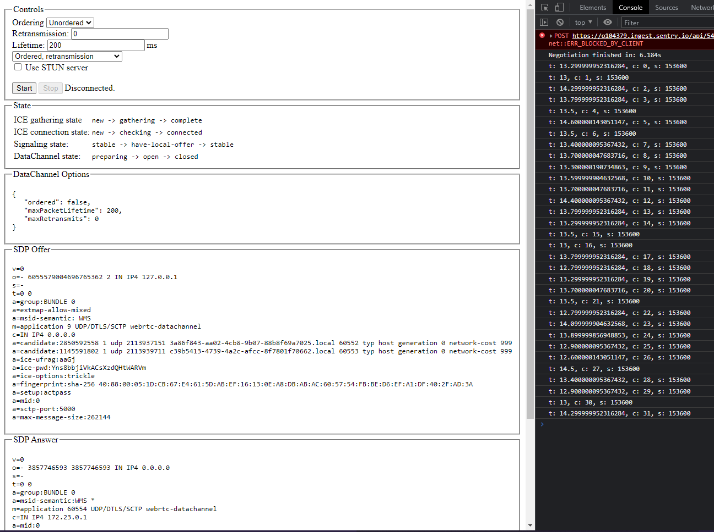

# WebRTC Client-Server DataChannel

An implementation of binary communication between a browser and server using WebRTC DataChannel.

[[_TOC_]]

## Introduction

This project is about testing WebRTC DataChannel API in terms of latency for usage between client and server communication. One possible usage for the project was testing real-time communication speed and latency. WebRTC gives some advantages over traditionally used WebSockets, for example the ability to ignore package ordering and retransmission. These features are most of the time not useful, and many times even detremental to real-time performance.

## License

This project is licensed under generic MIT license. [Details](./LICENSE)

## Requirements

Please note that the programs might work with earlier versions of these software, but they haven't been tested.

- Python 3.10+
- Pip 22.0+
- Node 14+
- Yarn 1.22+

Additional packages are required, but they will be installed automatically from `/package.json` and `/requirements.txt`

## Usage

### 1. Using Virtual environment

In case of using venv for python modules, follow these steps. If you do not know what this means, skip this step. This will create and activate the virtual environment in `/.venv/`

Activate venv

```bash
source ./venv.sh
```

This also installs dependencies for python, so you may skip the pipinstall in the next step.

### 2. Install Dependencies

```bash
yarn inst-all
```

or 

```bash
yarn install # NodeJS dependencies
yarn pipinstall # Python dependencies
```

### 3. Start Services

HTTP client service:

```bash
yarn serve
```

WebRTC server service:

```bash
yarn channel
```

## Testing

After stering the client service, a browser window will appear, where you can set your preferences for the DataChannel, then start testing.

Example:



## Acknowledgement

This project was created in association with Mediso Medial Imaging Systems ELTE Laboratories. [Website](https://medisolab.inf.elte.hu/)